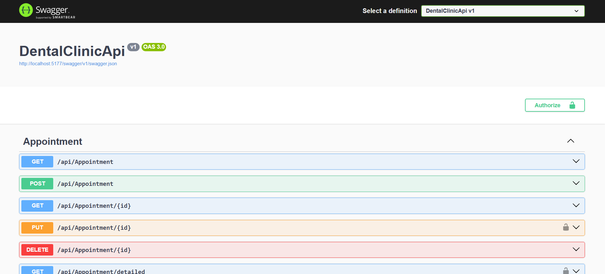

# 🦷 DentalClinicProject

Este proyecto es un **mono-repo** para gestionar una clínica odontológica.\
Incluye una **API RESTful** construida en **.NET 8 + MongoDB** y un **Frontend web** hecho con **React + Vite + Tailwind CSS**.

---

## 📂 Estructura del proyecto

```
DentalClinicProject/
├── backend/   # ASP.NET Core 8 + MongoDB + JWT
├── frontend/  # React 19 + Vite + Tailwind CSS
├── .gitignore # Ignora archivos innecesarios para ambos entornos
└── README.md  # Esta documentación
```

---

## 🚀 Tecnologías utilizadas

### ✅ Backend

- ASP.NET Core 8
- MongoDB (driver oficial)
- JWT (Json Web Tokens)
- Swagger / OpenAPI
- DataAnnotations
- Middleware global de manejo de errores
- Clean Architecture (Controllers, Services, Models, DTOs)

### ✅ Frontend

- React 19
- Vite
- Tailwind CSS

---

## 🔐 Funcionalidades destacadas

### 📌 Backend

- Registro e inicio de sesión de usuarios (`/api/User/signup` y `/api/User/signin`)
- Emisión de tokens JWT con roles (`user`, `admin`)
- Protección de endpoints mediante `[Authorize]` y `[Authorize(Roles = "admin")]`
- Validaciones con DataAnnotations en los DTOs
- Middleware global para manejo de errores
- Configuración de Swagger para probar endpoints con JWT
- CRUD completo de pacientes, dentistas, servicios y citas
- Registro de historial clínico (clinical records)

### 📌 Frontend (en construcción)

- Arquitectura modular con React + Tailwind
- Consumo de endpoints protegidos con JWT
- Panel administrativo y panel de usuarios

---

## 🖼️ Vista previa de Swagger



---

## ✅ Cómo ejecutar

### 🚀 Backend

```bash
cd backend
dotnet restore
dotnet run
```

Abre en navegador:

```
https://localhost:5177/swagger
```

---

### 🚀 Frontend

```bash
cd frontend
npm install
npm run dev
```

Abre en navegador:

```
http://localhost:5173
```

---

## 📌 Autenticación en Swagger

1. Ejecuta `/api/User/signup` o `/api/User/signin` para obtener un token JWT.
2. Copia el token **sin incluir **`` (Swagger lo agrega).
3. Haz clic en **Authorize** en Swagger.
4. Pega el token y prueba los endpoints protegidos.

---

## 📁 Estructura del Backend

```
backend/
├── Contexts/               # Configuración de MongoDB
├── Controllers/            # Controladores HTTP
├── DTOs/                   # Objetos de transferencia de datos
├── Middleware/             # Middleware global
├── Models/                 # Modelos de las entidades
├── Services/               # Lógica de negocio
├── Swagger/                # Filtro para Swagger con JWT
└── Program.cs              # Configuración principal
```

---

## 🧪 Ejemplo de credenciales

```json
{
  "username": "RaulDev",
  "email": "raul@example.com",
  "password": "123456",
  "role": "admin"
}
```

---

## ✨ Autor

- **Raúl Vanegas** — [GitHub](https://github.com/Raulvanegas7)

---

